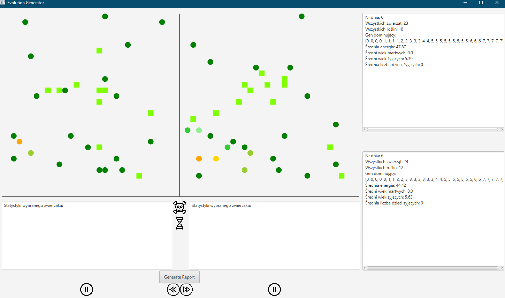

# Darwin Game

## Opis

Symulator ewolucji życia. Stworzony na starcie symulacji zestaw zwierząt może jeść dostępne na mapie rośliny, rozmnażać się i umierać. Każdy zwierzak ma swój własny zestaw genów, który jest po części przekazywany następnym pokoleniom (potomek posiada mix genów rodziców).

Projekt wykorzystuje GUI stworzone za pomocą JavaFX.

## Technologie

* Java
* JavaFX

## Działanie aplikacji

* Aplikacja okienkowa wyświetla jednocześnie dwie mapy, które działają niezależnie od siebie. 
* Po prawej stronie od dwóch Canvasów rysujących mapę znajdują się dwa pola tekstowe, które wypisują odpowiednie statystyki ogólne dla każdej z map.
* Pod każdym z Canvasów znajduje się jedno pole tekstowe, które wypisuje statystyki zwierzaka klikniętego przez użytkownika.
* Opis działania przycisków:
  * Przycisk Play znajdujący się pod każdą z map umożliwia zatrzymanie lub wznowienie działania każdej z map. Przyciski są dwa, dlatego że obie mapy można zatrzymywać niezależnie od siebie.
  * Przyciski przyspieszenia lub zwolnienia znajdujące się na środku umożliwiają zmniejszenie lub zwiększenie szybkości działania symulacji.
  * Przycisk przedstawiający czaszkę wyświetla na mapach te zwierzaki, które już są martwe. Przycisk działa dopiero gdy którakolwiek z symulacji jest zatrzymana (jedna mapa może działać, wtedy zmarłe zwierzęta będą wyświetlane tylko dla tej mapy, która jest zatrzymana).
  * Przycisk przedstawiający nić dna umożliwia wyświetlenie tych zwierzaków, których genotyp jest taki sam jak genotyp dominujący. Przycisk działa tylko gdy przynajmniej jedna z map jest zatrzymana.
* Gdy symulacja danej mapy jest zatrzymana wtedy odblokowana zostaje możliwość kliknięcia w dowolnego zwierzaka w celu podejrzenia jego statystyk. Jednak najpierw wyświetlone zostanie dodatkowe okno, w którym użytkownik podaje liczbę epok - dodatkowe statystyki przedstawiające liczbę dzieci i potomków klikniętego zwierzaka w przedziale dni (0, n].

## Opis mapy

1. Rośliny - są przedstawiane jako zielone kwadraty. Nigdy nie zmieniają koloru.

2. Zwierzęta - są przedstawiane w postaci kółek. Kolor każdego zwierzaka może być inny.

3. Oznaczenie koloru kółek na mapie:

   | Kolor                             | Poziom energii (życia) zwierzaka |
   | --------------------------------- | -------------------------------- |
   | Ciemno zielony (GREEN)            | >= 90%                           |
   | Zielony (LIMEGREEN)               | [80%, 90%)                       |
   | Jasny zielony (LIGHTGREEN)        | [70%, 80%)                       |
   | Żółto-zielony (YELLOWGREEN        | [60%, 70%)                       |
   | Żółty (YELLOW)                    | [50%, 60%)                       |
   | Złoty/ ciemno żółty (GOLD)        | [40%, 50%)                       |
   | Pomarańczowy (ORANGE)             | [30%, 40%)                       |
   | Pomarańczowo-czerwony (ORANGERED) | [20%, 30%)                       |
   | Czerwony (RED)                    | [10%, 20%)                       |
   | Ciemno-czerwony (DARKRED)         | (0%, 10%)                        |
   | Czarny (BLACK)                    | 0% - zwierzęta martwe            |

   

## Przegląd aplikacji

Na poniższym zrzucie ekranu widzimy dwie mapy działające niezależnie. Pod mapami znajdują się pola tekstowe wyświetlające dane dotyczące wybranego przez użytkownika zwierzaka. Po prawej stronnie od map wyświetlane są podstawowe statystyki dla każdej z map takie jak numer dnia, ilość zwierząt i roślin na mapie. Każdą z map można zatrzymywać, zwalniać i przyspieszać szybkość symulacji.

